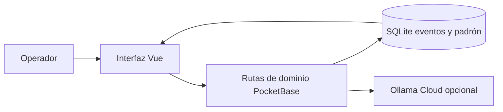

# Arquitectura candidata para evaluar

## Componentes

**PocketBase (candidato):** proceso local con SQLite, autenticación, API REST, panel administrativo y suscripciones en tiempo real. Si se elige, fijar versión y guardar migraciones en Git; `pb_data/` queda privado. Repositorio: https://github.com/pocketbase/pocketbase

**Vue 3 + Vite + SDK oficial (candidatos):** interfaz de búsqueda/captura en navegador. Repositorios: https://github.com/vuejs/core, https://github.com/vitejs/vite, https://github.com/pocketbase/js-sdk

**Ruta de dominio:** validar coincidencia única, casa, sujeto, estado previo, horario y `client_event_id`; escribir el evento y devolver estado derivado. La interfaz no cambia directamente los campos de estado. Las reglas API impiden actualizaciones o borrados arbitrarios del historial. Para varias estaciones, usar una instancia PocketBase compartida y realtime.

**Intérprete opcional:** texto/frase → JSON estructurado `{accion, tipo_sujeto, nombre, placa, modelo, color, casa, hora}`. Un servidor llama a Ollama Cloud con clave en entorno; el navegador nunca recibe la clave. La respuesta se cruza con el padrón y se muestra como propuesta para revisar. PocketBase JSVM tiene `$http.send` para llamadas externas; comprobar su manejo de secretos/errores antes de integrarlo. El fallback determinista siempre queda disponible.

## Estados y tiempo

Los registros de estado son **vistas derivadas** de eventos, no columnas editadas a mano. La hora de observación puede ser nula; `reported_at` se guarda cuando llega el aviso. El orden de incorporación de eventos es estable. Si un evento tardío tiene hora anterior, una rectificación o reconciliación explícita decide el último estado; no ordenar sin contexto para reescribir el historial.

## Backups y operación

Si se adopta PocketBase, probar respaldos y restauración antes de usarlo para operación. El XLSX del 3 de octubre en esta carpeta sirve solo de contexto. **El Excel actual fuera del proyecto sigue en uso mientras se construye la app.** No hay sincronización ni reemplazo acordados.

## Límites conscientes

La app inicial usa una instancia única; no requiere Docker ni un servicio SaaS de base de datos. Ollama Cloud requiere Internet/clave y envía el texto dictado al proveedor. Las consultas/captura manual operan sin él. No usar imágenes de referencia de internet para reconocer placas reales.
